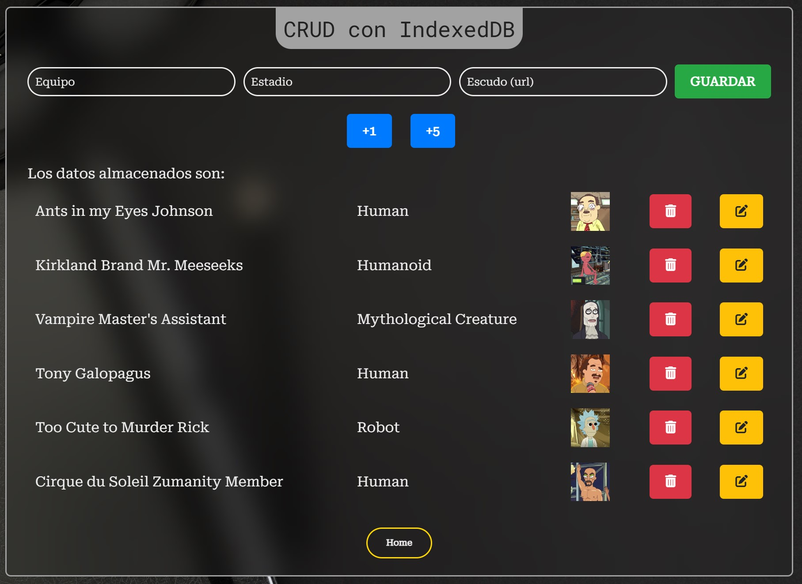
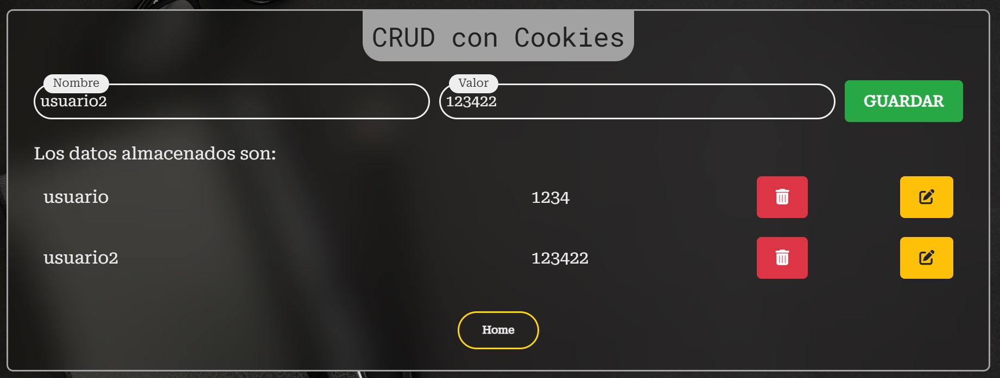
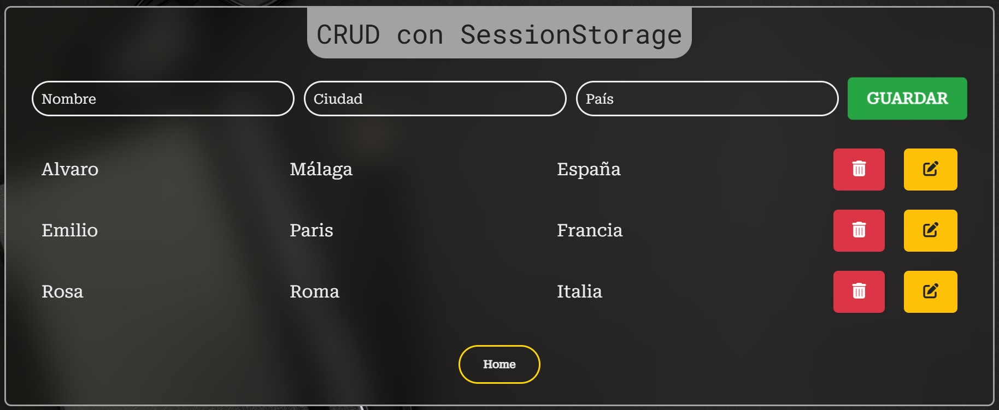
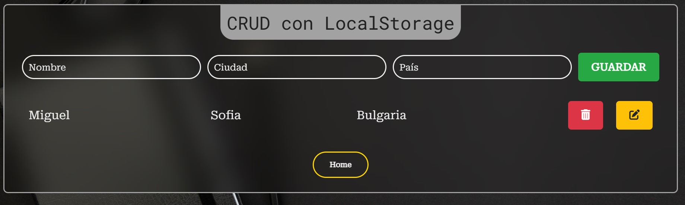

<h1>Fundamentos JS (ES6)</h1>

<h2>🚀 Últimas Actualizaciones</h2>
<h6>🗂️ Crud con IndexedDB</h6>

Crud con IndexedDB para guardar personajes, con su nombre, especie y una imágen de estos en una tabla generada a partir de los datos que contiene la base de datos de IndexedDB. Además se pueden grabar datos usando los botones +1 y +5, los cuáles taeran aleatoriamente uno o cinco personaje de la serie Ricky y Morty haciendo uso de una api.
La tabla también incluye botones de eliminar y actualizar cada una de las filas de esta.

<h6>🗂️ Crud con Cookies</h6>

Crud con Cookies que permite guardar en una tabla pares nombre/valor durante 1 minuto, también en cada fila de la tabla se dispone de botones de borrar y acutalizar estos datos.

<h6>🗂️ Crud con SessionStorage</h6>

Crud son SessionStorage para guardar datos con los campos nombre, ciudad y país. Pudiendo tanto aliminarlos como actualizarlos usando los botones de la tabla.

<h6>🗂️ Crud con LocalStorage</h6>

Crud son LocalStorage para guardar datos con los campos nombre, ciudad y país. Pudiendo tanto aliminarlos como actualizarlos usando los botones de la tabla.

<h6>🎨 Modificación Estilo</h6>

Cambio de estilo en el login y en los backgrounds de cada página

<h2>Estructura de directorios</h2>

<h2>Table of Contents</h2>
<ul>
  <li><a href="#introduccion">Introduction</a></li>
  <li><a href="#descripcion">Description</a></li>
  <li><a href="#estilo">Style</a></li>
</ul>

<h2 id="introduccion">Introduction</h2>

Work done by: Álvaro López Guerrero

2024-2025

License CC-BY

<h2 id="descripcion">Description</h2>

Web page project for the subject Web development in client environment of 2º DAW, on the basics of JS (EC6) with exercises. Styled website using <a href ="https://getbootstrap.com/">Bootstrap</a>

<h2 id="estilo">Site style</h2>
<h3>Color Palette</h3>
<ul>
  <li>#222831</li>  
  <li>#393E46</li>
  <li>#FFD600</li>
  <li>#EEEEEE</li>
</ul>

<h3>Fonts</h3>

For the titles: Roboto Mono.

For the body text: Roboto Serif.

<h3>Bootstrap Components</h3>
<a href ="https://getbootstrap.com/docs/5.3/components/navbar/#how-it-works">
NavBar from bootstrap
</a>

<h3 id="snippets">Code snippets</h3>

I have used the following:

<ul>
  <li>Buttons: from <a href="https://uiverse.io/all?search=button">uiverse.io.</a> </li>
</ul>
