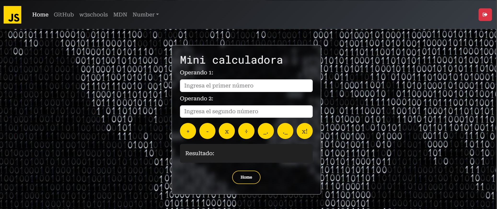
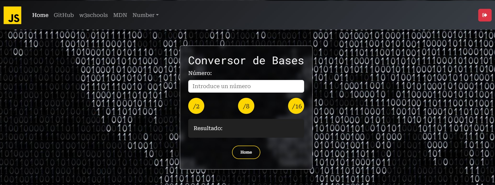

<h1>Fundamentos JS (ES6)</h1>

<h2>New Updates !!!</h2>
<h6>Login con Formulario con control de sesión - Cookies</h6>

Implementación de un sistema de login con formulario con validaciones mediante expresiones regulares, tanto para el usuario como para la contraseña. Cuando los datos no son válidos se muestran mensajes de errores, que desaparecen automáticamente cuando el usuario corrige los campos usando eventos.

La validación de credenciales se realiza al enviar el formulario (evento `submit`), mostrando un mensaje que indica si las credenciales son incorrectas o dando la bienvenida en caso de que sean correctas.

Tras validar correctamente las credenciales, la página redirige al usuario a menu de esta donde podra navegar y entre las opciones de la navbar con el uso de <b>window.location.href</b> y se crea una cookie que expira en un 1 minuto.

El archico logout.js implementa un botón que sirve como cierre de sesión al usuario, al hacer que la cookie expira, que checkea en que ruta se encuentra para que dicho botón funcione independientemente de en que ruta se encuentra el usuario. Además cuando el archivo getCookie.js observa que la cookie (tras pasar un minuto) ha sido expirada al cambiar de dirección o recargar la página, redireccionará al usuario al login y deberá iniciar sesión nuevamente

<h6>Number - Mini-Calculadora</h6>

Mini-Calculadora que opera con dos números introducidos por el usuario y muestra el resultado. Realiza las operaciones de suma, resta, multiplicación, división, valor entero, parte decimal y factorial.

<h6>Number - Conversor de Bases</h6>

Convierte un número decimal ingresado por el usuario a una de las bases elegidas (binario, octal o hexadecimal).

<h6>Rendimiento</h6>

Minificación archivo css, eliminar espacios y comentarios. Y uso de variables en la paleta de colores para mejorar legibilidad

<h2>Table of Contents</h2>
<ul>
  <li><a href="#introduccion">Introduction</a></li>
  <li><a href="#descripcion">Description</a></li>
  <li><a href="#estilo">Style</a></li>
</ul>

<h2 id="introduccion">Introduction</h2>

Work done by: Álvaro López Guerrero

2024-2025

License CC-BY

<h2 id="descripcion">Description</h2>

Web page project for the subject Web development in client environment of 2º DAW, on the basics of JS (EC6) with exercises. Styled website using <a href ="https://getbootstrap.com/">Bootstrap</a>

<h2 id="estilo">Site style</h2>
<h3>Color Palette</h3>
<ul>
  <li>#222831</li>  
  <li>#393E46</li>
  <li>#FFD600</li>
  <li>#EEEEEE</li>
</ul>

<h3>Fonts</h3>

For the titles: Roboto Mono.

For the body text: Roboto Serif.

<h3>Bootstrap Components</h3>
<a href ="https://getbootstrap.com/docs/5.3/components/navbar/#how-it-works">
NavBar from bootstrap
</a>

<h3 id="snippets">Code snippets</h3>

I have used the following:

<ul>
  <li>Buttons: from <a href="https://uiverse.io/all?search=button">uiverse.io.</a> </li>
</ul>
