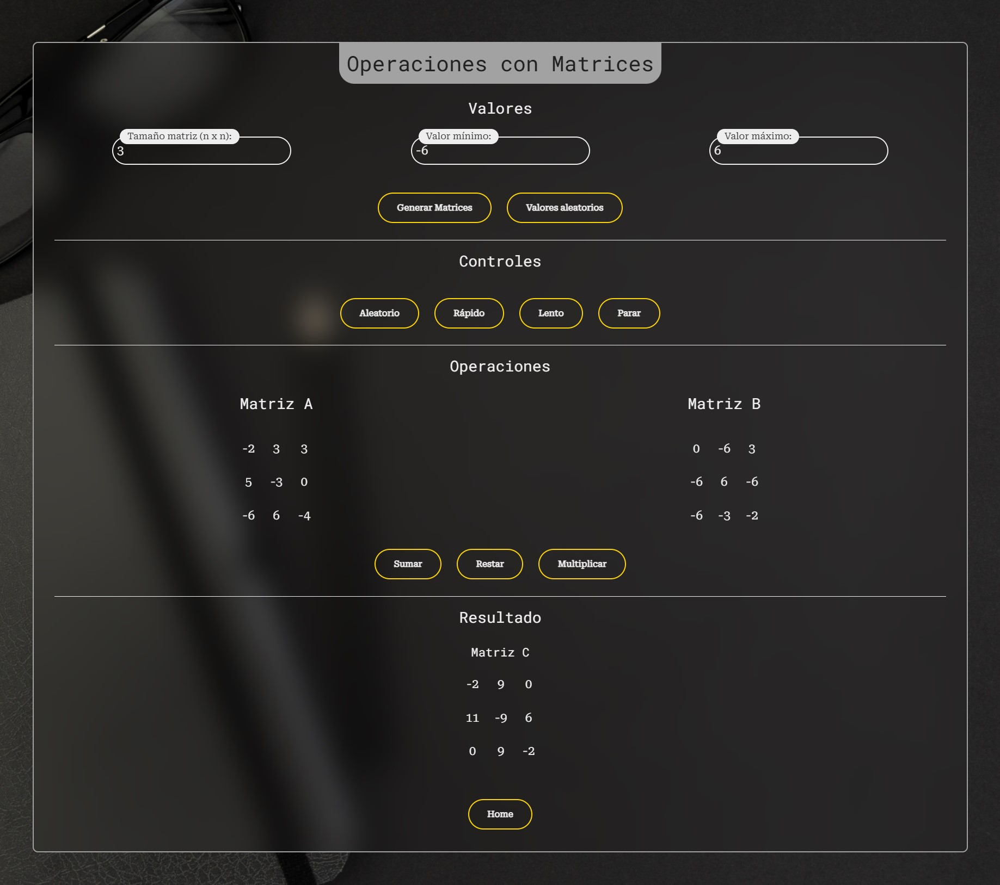
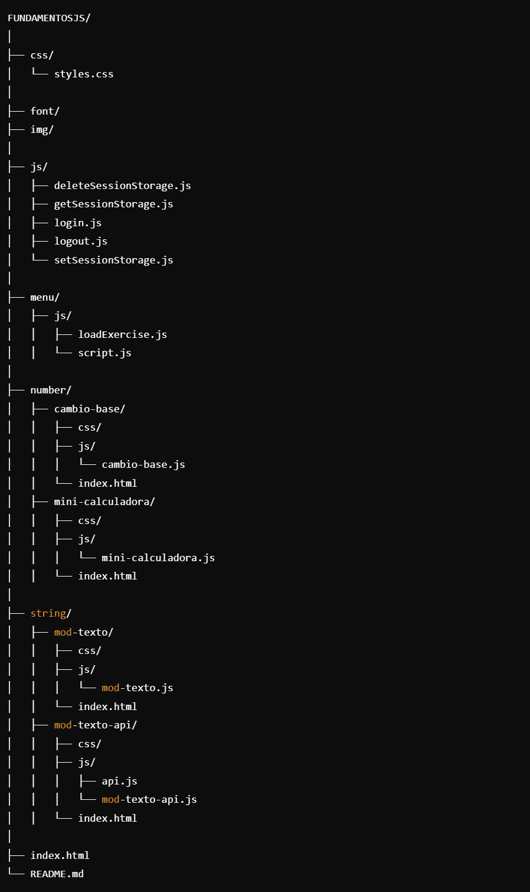

<h1>Fundamentos JS (ES6)</h1>

<h2>🚀 Últimas Actualizaciones</h2>
<h6>🔑 Login con Formulario con control de sesión - IndexedDB</h6>

Formulario de login con validaciones mediante expresiones regulares, tanto para el usuario como para la contraseña. Cuando los datos no son válidos se muestran mensajes de errores, que desaparecen automáticamente cuando el usuario corrige los campos usando eventos. Validación de credenciales de usuario y  se controla las sesiones utilizando IndexedDB. Una vez que el usuario inicia sesión correctamente, se almacena un valor en en la base de datos creada para mantener la sesión activa hasta que el usuario cierre sesión mediante el boton de logout.

<h6>➗ Array - Operaciones con matrices</h6>

Realiza operaciones básicas con matrices cuadradas generadas aleatoriamente, introduciendo valores de rangos por el usuario o de manera también aleatoria. Se incluyen suma, resta y multiplicación de matrices. Además, el programa permitirá realizar pruebas automáticas repetidas, gnerando matrices y el resultado de la operación de manera sistemática a lo largo del tiempo pudiendo aumentar su velocidad o disminuirla hasta que el usuario pulse el botón de parar.

<h6>🎨 Modificación Estilo</h6>

Cambio de estilo en el login y en los backgrounds de cada página

<h2>Estructura de directorios</h2>

<h2>Table of Contents</h2>
<ul>
  <li><a href="#introduccion">Introduction</a></li>
  <li><a href="#descripcion">Description</a></li>
  <li><a href="#estilo">Style</a></li>
</ul>

<h2 id="introduccion">Introduction</h2>

Work done by: Álvaro López Guerrero

2024-2025

License CC-BY

<h2 id="descripcion">Description</h2>

Web page project for the subject Web development in client environment of 2º DAW, on the basics of JS (EC6) with exercises. Styled website using <a href ="https://getbootstrap.com/">Bootstrap</a>

<h2 id="estilo">Site style</h2>
<h3>Color Palette</h3>
<ul>
  <li>#222831</li>  
  <li>#393E46</li>
  <li>#FFD600</li>
  <li>#EEEEEE</li>
</ul>

<h3>Fonts</h3>

For the titles: Roboto Mono.

For the body text: Roboto Serif.

<h3>Bootstrap Components</h3>
<a href ="https://getbootstrap.com/docs/5.3/components/navbar/#how-it-works">
NavBar from bootstrap
</a>

<h3 id="snippets">Code snippets</h3>

I have used the following:

<ul>
  <li>Buttons: from <a href="https://uiverse.io/all?search=button">uiverse.io.</a> </li>
</ul>
