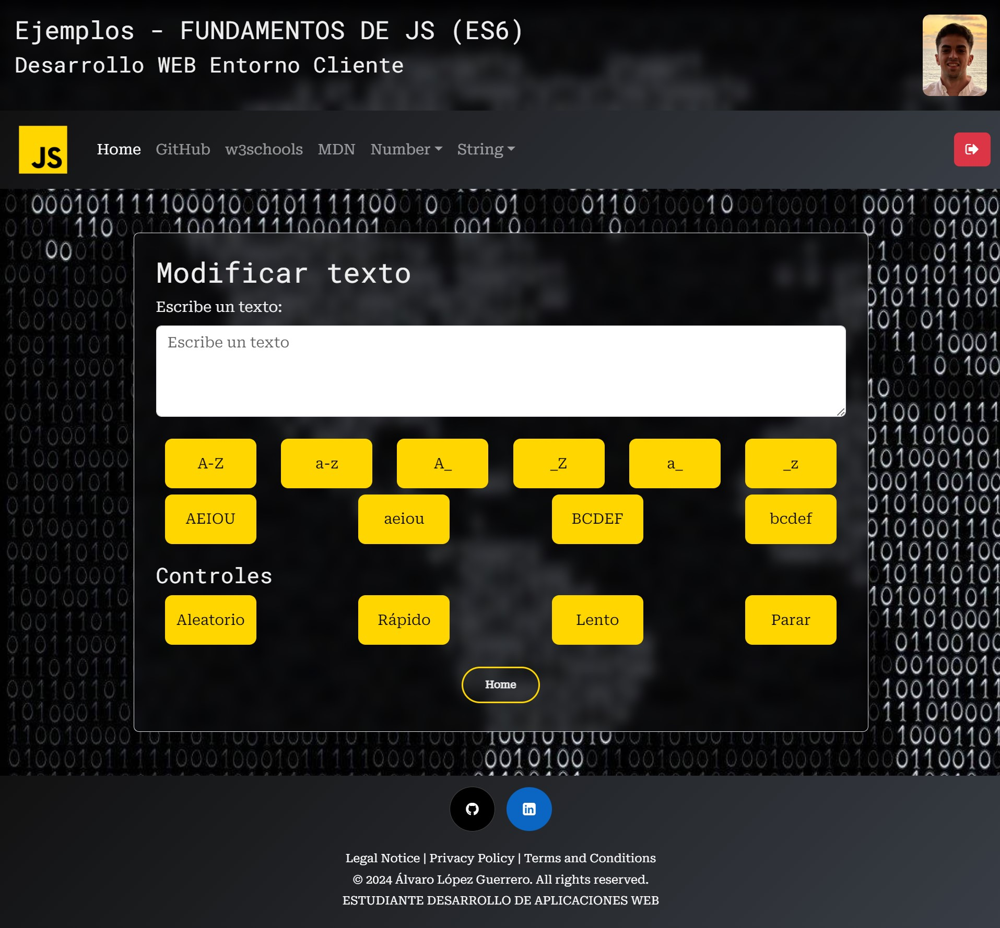
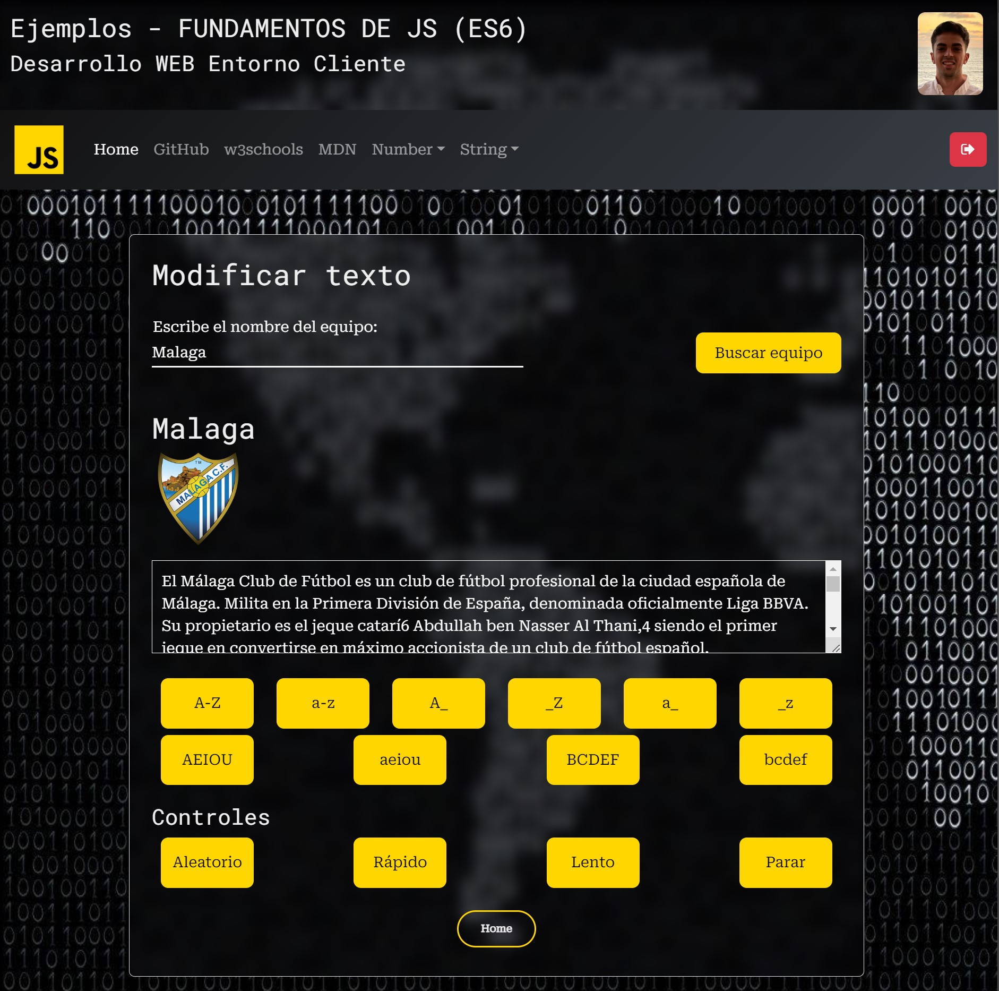

<h1>Fundamentos JS (ES6)</h1>

<h2>New Updates !!!</h2>
<h6>Login con Formulario con control de sesión - SessionStorage</h6>

Formulario de login con validaciones mediante expresiones regulares, tanto para el usuario como para la contraseña. Cuando los datos no son válidos se muestran mensajes de errores, que desaparecen automáticamente cuando el usuario corrige los campos usando eventos. Validación de credenciales de usuario y  se controla las sesiones utilizando sessionStorage. Una vez que el usuario inicia sesión correctamente, se almacena un valor en sessionStorage para mantener la sesión activa hasta que el usuario cierre sesión mediante el boton de logout (ARREGALDO) o cierre la ventana del navegador.

<h6>String - Modificar Texto</h6>

Transforma el texto introducido en una de las formas elegidas, incluye también un generador aleatorio, con aumento y disminución de velocidad eliminando los datos de la sesión de sessionStorage.

<h6>String - Modificar Texto - API</h6>

Transforma el texto generado desde una api de base de datos de deportes en una de las formas elegidas, incluye también un generador aleatorio, con aumento y disminución de velocidad.

<h2>Estructura de directorios</h2>

<h2>Table of Contents</h2>
<ul>
  <li><a href="#introduccion">Introduction</a></li>
  <li><a href="#descripcion">Description</a></li>
  <li><a href="#estilo">Style</a></li>
</ul>

<h2 id="introduccion">Introduction</h2>

Work done by: Álvaro López Guerrero

2024-2025

License CC-BY

<h2 id="descripcion">Description</h2>

Web page project for the subject Web development in client environment of 2º DAW, on the basics of JS (EC6) with exercises. Styled website using <a href ="https://getbootstrap.com/">Bootstrap</a>

<h2 id="estilo">Site style</h2>
<h3>Color Palette</h3>
<ul>
  <li>#222831</li>  
  <li>#393E46</li>
  <li>#FFD600</li>
  <li>#EEEEEE</li>
</ul>

<h3>Fonts</h3>

For the titles: Roboto Mono.

For the body text: Roboto Serif.

<h3>Bootstrap Components</h3>
<a href ="https://getbootstrap.com/docs/5.3/components/navbar/#how-it-works">
NavBar from bootstrap
</a>

<h3 id="snippets">Code snippets</h3>

I have used the following:

<ul>
  <li>Buttons: from <a href="https://uiverse.io/all?search=button">uiverse.io.</a> </li>
</ul>
