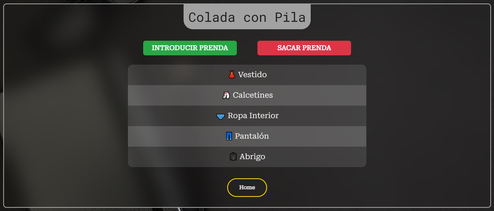
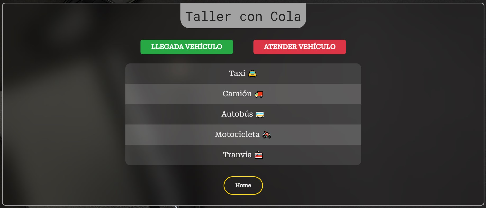
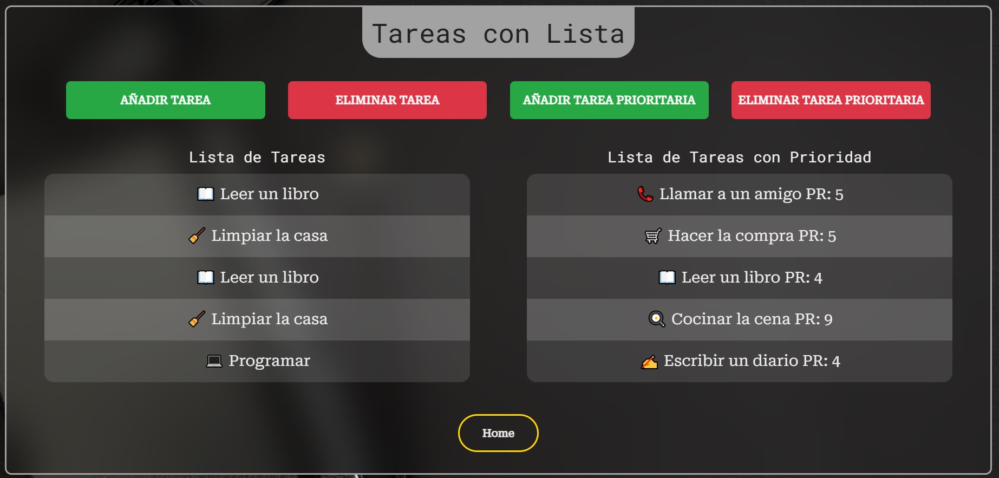

<h1>Fundamentos JS (ES6)</h1>

<h2>🚀 Últimas Actualizaciones</h2>
<h6>📦 Colada con Pila</h6>

Gestión de la colada siguiendo el modelo de una pila LIFO (Último en Entrar, Primero en Salir). Esto significa que la última prenda en añadirse será la primera en retirarse. Incluye botones para **añadir prenda** y **eliminar prenda**. La cesta tiene un límite máximo de 10 prendas.

<h6>🚗 Taller con Cola</h6>

Lista de espera del taller basada en el modelo de una Cola FIFO (Primero en Entrar, Primero en Salir). Esto significa que el primer vehículo en llegar será el primero en ser atendido. Incluye botones para **recibir la llegada de un vehículo** y **atender vehículo**. La cola del taller tiene un límite máximo de 10 vehículos.
 

<h6>📝 Tareas con Listas</h6>

Gestión de tareas utilizando listas. Las tareas generales se añaden pulsando el botón de **añadir**, y al pulsar el botón de **eliminar**, las tareas desaparecen de forma aleatoria. Por otro lado, las tareas prioritarias se gestionan de manera similar, pero al eliminarlas desaparecen las de mayor prioridad (es decir, con el número más bajo). Ambas listas tienen un límite máximo de 10 tareas.

<h6>🎨 Modificación Estilo</h6>

Cambio de estilo en el login y en los backgrounds de cada página

<h2>Estructura de directorios</h2>

<h2>Table of Contents</h2>
<ul>
  <li><a href="#introduccion">Introduction</a></li>
  <li><a href="#descripcion">Description</a></li>
  <li><a href="#estilo">Style</a></li>
</ul>

<h2 id="introduccion">Introduction</h2>

Work done by: Álvaro López Guerrero

2024-2025

License CC-BY

<h2 id="descripcion">Description</h2>

Web page project for the subject Web development in client environment of 2º DAW, on the basics of JS (EC6) with exercises. Styled website using <a href ="https://getbootstrap.com/">Bootstrap</a>

<h2 id="estilo">Site style</h2>
<h3>Color Palette</h3>
<ul>
  <li>#222831</li>  
  <li>#393E46</li>
  <li>#FFD600</li>
  <li>#EEEEEE</li>
</ul>

<h3>Fonts</h3>

For the titles: Roboto Mono.

For the body text: Roboto Serif.

<h3>Bootstrap Components</h3>
<a href ="https://getbootstrap.com/docs/5.3/components/navbar/#how-it-works">
NavBar from bootstrap
</a>

<h3 id="snippets">Code snippets</h3>

I have used the following:

<ul>
  <li>Buttons: from <a href="https://uiverse.io/all?search=button">uiverse.io.</a> </li>
</ul>
